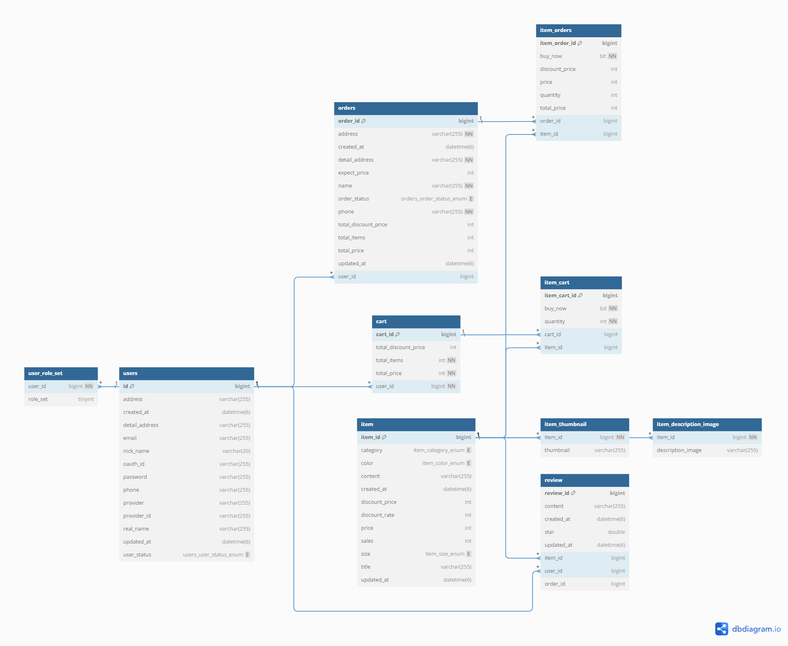
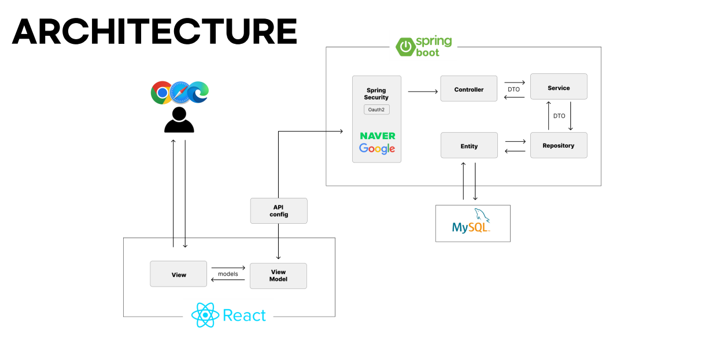

# 2NY

## 🚀 프로젝트 소개

프로젝트에 대한 간단한 설명을 작성합니다.

## 🌟 주요 기능

1. **회원관리**
    - 회원가입, 로그인, 회원 정보 수정, 회원 정보 조회, 회원 탈퇴
    - 아이디, 비밀번호 찾기
    - User Role에 따른 정보 제한

2. **상품관리**
    - ChatBot 기능
    - 상품 메인 페이지 (정렬 & 필터링), 상품 상세페이지
    - Admin 계정의 상품 등록 및 수정과 삭제
    - 상품에 대한 리뷰 작성 및 수정,삭제

3. **주문관리**
    - 장바구니 조회, 장바구니 내 상품 추가 및 수정, 삭제
    - 주문 조회, 주문 상세 조회, 주문 등록
    - Admin 계정의 주문 상태 수정
    - 장바구니 or 상품 개별 주문 시 무통장입금/카카오페이 결제 기능


### 🔎 Team Member

| 김신이(PL) | 이소현 | 조민준 | 채현영 |
| --- | --- | --- | --- |
|  |  |  |  |
| [@SiNiKin](https://github.com/SiNiKin) | [@LeeSoHyunn](https://github.com/LeeSoHyunn) | [@Rencal3491](https://github.com/Rencal3491) | [@CheHyeonYeong](https://github.com/CheHyeonYeong)  |

### 프로젝트 개요

API를 이용한 웹 애플리케이션

**앱 이름**: 2NY

# 🖥️ 설치 및 실행 방법

# 클론 repository
git clone https://github.com/ToriArtis/2NY-Frontend.git

# 프로젝트 디렉토리로 이동
cd 2NY-Frontend

# 의존성 설치
npm install <br />
npm install @mui/material @mui/styled-engine-sc styled-components <br />
npm install react-slick slick-carousel <br />
npm install react-kakao-login <br />
npm install react-naver-login <br />
npm install @react-oauth/google <br />
npm install react-quill

# 개발 서버 실행
npm start

### 활용 장비 및 재료


### 프로젝트 구조

#### ERD 및 아키텍처




## 📂 디렉토리 구조

```plaintext
2ny-frontend/
├── public/
│   ├── assets/
│   │   └── favicon.ico
│   ├── index.html
│   ├── manifest.json
│   └── robots.txt
├── src/
│   ├── cart/
│   │   ├── api/
│   │   ├── components/
│   │   ├── hooks/
│   │   ├── models/
│   │   ├── viewModels/
│   │   └── views/
│   ├── chat/
│   │   ├── ChatbotView.css
│   │   ├── ChatbotView.js
│   │   ├── chatModel.js
│   │   └── ChatViewModel.js
│   ├── component/
│   │   ├── css/
│   │   ├── pages/
│   │   ├── BlueButton.js
│   │   ├── Footer.js
│   │   ├── Header.js
│   │   └── WhiteButton.js
│   ├── config/
│   │   └── app-config.js
│   ├── error/
│   │   ├── api/
│   │   ├── components/
│   │   ├── hooks/
│   │   ├── models/
│   │   ├── viewModels/
│   │   └── views/
│   ├── items/
│   │   ├── api/
│   │   ├── components/
│   │   ├── hooks/
│   │   ├── models/
│   │   ├── viewModels/
│   │   └── views/
│   ├── orders/
│   │   ├── api/
│   │   ├── components/
│   │   ├── hooks/
│   │   ├── models/
│   │   ├── viewModels/
│   │   └── views/
│   ├── review/
│   │   ├── api/
│   │   ├── components/
│   │   ├── hooks/
│   │   ├── models/
│   │   ├── viewModels/
│   │   └── views/
│   ├── users/
│   │   ├── api/
│   │   ├── components/
│   │   ├── hooks/
│   │   ├── models/
│   │   ├── viewModels/
│   │   └── views/
│   ├── App.css
│   ├── App.js
│   ├── App.test.js
│   ├── AppRouter.js
│   ├── Config.js
│   ├── index.css
│   ├── index.js
│   ├── logo.svg
│   ├── reportWebVitals.js
│   └── setupTests.js
├── .env
├── .gitignore
├── package-lock.json
├── package.json
├── README.md
└── README.old.md


```

# 프로젝트 수행결과

https://url.kr/5lp1cg

